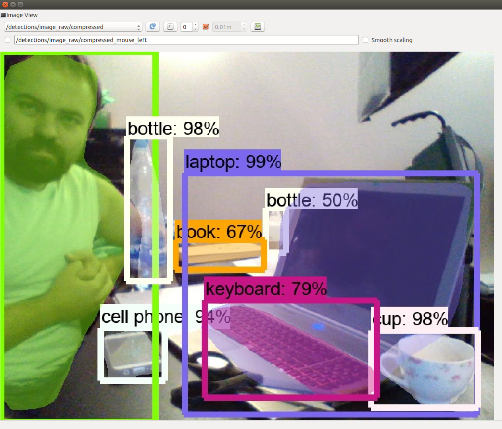

# Tensorflow Object Detection API in a ROS node!!!

# Install https://github.com/tensorflow/models/blob/master/research/object_detection/g3doc/installation.md


# Download models
You can download manually from the models zoo: https://github.com/tensorflow/models/blob/master/research/object_detection/g3doc/detection_model_zoo.md

Or you can use the download script provided in this repo!!!

It will download all models for you:

```
python scripts/download_all_models.py
```

or you can use **ROS** to run it:

```
rosrun object_detection_tensorflow download_all_models.py
```

This script will download 28 models for you (Updated on 2018.09.16):
1. faster_rcnn_inception_resnet_v2_atrous_coco_2018_01_28
2. faster_rcnn_inception_resnet_v2_atrous_lowproposals_coco_2018_01_28
3. faster_rcnn_inception_resnet_v2_atrous_lowproposals_oid_2018_01_28
4. faster_rcnn_inception_resnet_v2_atrous_oid_2018_01_28
5. faster_rcnn_inception_v2_coco_2018_01_28
6. faster_rcnn_nas_coco_2018_01_28
7. faster_rcnn_nas_lowproposals_coco_2018_01_28
8. faster_rcnn_resnet101_ava_v2.1_2018_04_30
9. faster_rcnn_resnet101_coco_2018_01_28
10. faster_rcnn_resnet101_kitti_2018_01_28
11. faster_rcnn_resnet101_lowproposals_coco_2018_01_28
12. faster_rcnn_resnet50_coco_2018_01_28
13. faster_rcnn_resnet50_lowproposals_coco_2018_01_28
14. mask_rcnn_inception_resnet_v2_atrous_coco_2018_01_28
15. mask_rcnn_inception_v2_coco_2018_01_28
16. mask_rcnn_resnet101_atrous_coco_2018_01_28
17. mask_rcnn_resnet50_atrous_coco_2018_01_28
18. rfcn_resnet101_coco_2018_01_28
19. ssd_inception_v2_coco_2018_01_28
20. ssdlite_mobilenet_v2_coco_2018_05_09
21. ssd_mobilenet_v1_0.75_depth_300x300_coco14_sync_2018_07_03
22. ssd_mobilenet_v1_0.75_depth_quantized_300x300_coco14_sync_2018_07_18
23. ssd_mobilenet_v1_coco_2018_01_28
24. ssd_mobilenet_v1_fpn_shared_box_predictor_640x640_coco14_sync_2018_07_03
25. ssd_mobilenet_v1_ppn_shared_box_predictor_300x300_coco14_sync_2018_07_03
26. ssd_mobilenet_v1_quantized_300x300_coco14_sync_2018_07_18
27. ssd_mobilenet_v2_coco_2018_03_29
28. ssd_resnet50_v1_fpn_shared_box_predictor_640x640_coco14_sync_2018_07_03

# Run Webcam example

I provide example ROS launch files for:

## SSD Mobilenet V2

```
roslaunch object_detection_tensorflow ssd_mobilenet_v2.launch
```


## Mask RCNN Inception V2

```
roslaunch object_detection_tensorflow mask_rcnn_inception_v2.launch
```



# Nodes

## object_detection_tensorflow.py

### Published Topics

- ~detections/image_raw/compressed (sensor_msgs/CompressedImage)

### Parameters

- **~camera_topic** default: **/image_raw** - Input topic
- **~models_dir** - directory where models are downloaded
- **~model_name** - name of the directory where the model is located
- **~path_to_labels** - path to labels.pbtxt
- **~num_classes** default: 90 - number o classes
